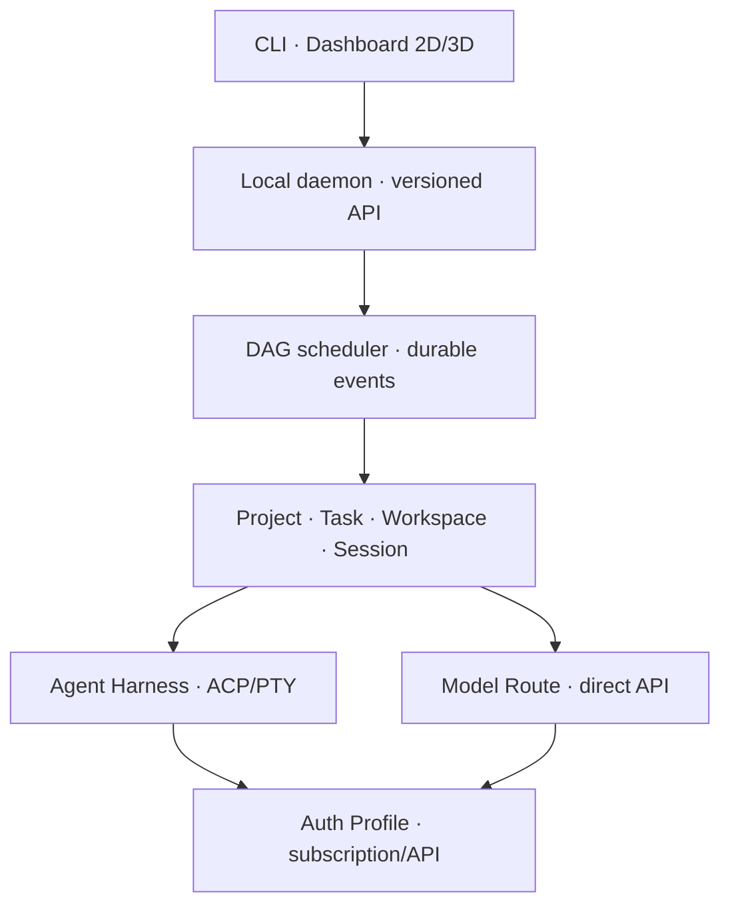

# CCSwitch — Kế hoạch phát triển dành cho Claude

> Phiên bản kế hoạch: 1.1  
> Trạng thái: Sẵn sàng bắt đầu Pha 0  
> Mục đích: Giao cho Claude phát triển `ccswitch` bằng cách học hỏi linh hoạt từ các dự án mã nguồn mở, kiểm chứng các cơ chế quan trọng và xây một sản phẩm có bản sắc riêng, hỗ trợ cả tài khoản subscription lẫn AI API.

---

## 1. Chỉ thị tổng quát cho Claude

Bạn là Staff Engineer chịu trách nhiệm phát triển `ccswitch` từ công cụ đổi tài khoản Claude Code thành một **local-first control plane cho nhiều coding agent**.

Bạn phải giữ nguyên tinh thần của dự án:

1. **Đã đo — không suy luận.** Không coi vị trí token, biến môi trường, hành vi refresh, session resume hoặc trạng thái CLI là đúng cho đến khi có thí nghiệm tái lập được.
2. **Whitelist — không blacklist.** Chỉ chia sẻ file và khóa config đã biết là an toàn.
3. **Xóa an toàn.** Không bao giờ xóa dữ liệu gốc, credential gốc hoặc project của người dùng vì một session bị xóa.
4. **Ghi nguyên tử.** Mọi state/config quan trọng phải dùng temp file + fsync phù hợp + rename/replace, hoặc transaction database.
5. **Local-first, một binary.** Lõi chạy độc lập trên Windows và Linux; dashboard chỉ là client của lõi.
6. **Trung thực về năng lực.** Provider phải được gắn `stable`, `experimental` hoặc `unsupported` dựa trên bằng chứng.

Mục tiêu cuối cùng không phải là “mở nhiều terminal”. Mục tiêu là:

> Một control plane có thể dùng cả subscription profile và API profile, gắn chúng vào coding agent hoặc model route phù hợp, chạy trong workspace biệt lập của project, điều phối bằng flow khai báo được, lưu trạng thái bền vững và quan sát realtime.

---

## 2. Cách học linh hoạt từ mã nguồn mở

Không bắt buộc mọi ý tưởng học được đều phải tạo ADR hoặc bộ hồ sơ riêng. Claude được phép đọc, thử nghiệm, port hoặc điều chỉnh các pattern hữu ích theo cách nhanh nhất phù hợp với task.

Chu trình khuyến nghị cho những phần quan trọng hoặc có rủi ro cao:

1. **Study:** đọc README, tài liệu kiến trúc, mã nguồn liên quan, issue và test.
2. **Pin:** ghi URL, giấy phép, commit SHA/tag đã nghiên cứu và ngày truy cập.
3. **Extract:** mô tả nguyên lý cần học bằng ngôn ngữ trung lập, không phụ thuộc tên class/package của upstream.
4. **Evaluate:** đánh giá nguyên lý đó với các ràng buộc của `ccswitch`: Go, Windows + Linux, local-first, một binary, bảo mật credential.
5. **Decide:** ghi decision note hoặc ADR khi quyết định ảnh hưởng boundary, dữ liệu, bảo mật hoặc khả năng tương thích.
6. **Adapt:** port, tái triển khai hoặc điều chỉnh theo domain và conventions của `ccswitch`.
7. **Verify:** thêm unit, integration, concurrency, recovery và security tests.
8. **Compound:** cập nhật `docs/knowledge/` để những pha sau không phải nghiên cứu lại.

Chỉ tạo hồ sơ đầy đủ khi nghiên cứu lớn, khi port mã trực tiếp hoặc khi quyết định có khả năng ảnh hưởng nhiều pha:

```text
docs/research/<topic>/
├── SOURCES.md          # URL, license, commit/tag, file đã đọc
├── FINDINGS.md         # nguyên lý và phát hiện
├── DECISION.md         # chọn/bỏ/điều chỉnh và lý do
└── TEST-EVIDENCE.md    # lệnh chạy, môi trường, output đã làm sạch token
```

### Quy tắc giấy phép

- Có thể học và tái triển khai nguyên lý từ mọi dự án.
- Chỉ đưa mã nguồn trực tiếp vào sản phẩm sau khi xác nhận giấy phép tương thích và giữ đầy đủ attribution/copyright bắt buộc.
- MIT/Apache-2.0 vẫn phải ghi nguồn khi lấy mã cụ thể.
- Dự án AGPL/GPL chỉ dùng để học hành vi và kiến trúc, trừ khi chủ dự án quyết định chấp nhận nghĩa vụ của giấy phép đó.
- Khi lấy hoặc port mã cụ thể, ghi vào `docs/OPEN_SOURCE_LEDGER.md`: dự án, URL, license, commit, nội dung sử dụng và attribution.

---

## 3. Bản đồ dự án tham khảo

### Nhóm A — phải nghiên cứu trước khi đóng kiến trúc lõi

| Dự án | Giấy phép | Học phần nào | Không bê nguyên |
|---|---|---|---|
| [farion1231/cc-switch](https://github.com/farion1231/cc-switch) | MIT | Provider/config management, SQLite SSOT, đồng bộ live config, atomic write, backup, usage/session | Rust/Tauri, proxy provider thương mại, domain model gắn chặt GUI |
| [Agent Deck](https://github.com/asheshgoplani/agent-deck) | MIT | Go session manager, fleet, project grouping, worktree, fork/resume, MCP/Skills, web command center | tmux/WSL làm runtime bắt buộc; `ccswitch` phải chạy Windows native |
| [multiclaude](https://github.com/dlorenc/multiclaude) | MIT | Go daemon, IPC, atomic state, health loop, crash recovery, worktree lifecycle | Chỉ Claude, polling cứng, tự động bỏ permission, Unix socket/tmux assumptions |
| [Agent Client Protocol](https://github.com/agentclientprotocol/agent-client-protocol) | Apache-2.0 | Session/prompt/cancel, streaming event, permission request, capability negotiation | ACP không quản lý subscription credential hoặc AI API và không thay thế Harness/AI Provider Adapter |
| [ACP Go SDK](https://github.com/coder/acp-go-sdk) | Apache-2.0 | Typed ACP client, stdio transport, bridge Claude/Gemini, extension methods | Không để SDK types rò vào toàn bộ domain core |

### Nhóm B — nghiên cứu khi làm orchestration và flow

| Dự án | Giấy phép | Học phần nào | Không bê nguyên |
|---|---|---|---|
| [Gas Town](https://github.com/gastownhall/gastown) | MIT | Agent identity, project container, watchdog, handoff, workflow formula, merge queue, failure recovery | Toàn bộ hệ thống thuật ngữ và độ phức tạp 20–30 agent |
| [Beads](https://github.com/gastownhall/beads) | Theo repo tại commit nghiên cứu | Dependency graph, claim/close task, durable memory, ready queue | Bắt buộc người dùng cài thêm hệ thống riêng hoặc dùng Dolt ngay từ đầu |
| [Compound Engineering](https://github.com/EveryInc/compound-engineering-plugin) | Theo repo tại commit nghiên cứu | Brainstorm → plan → implement → review → compound; tích lũy tri thức sau mỗi task | Biến prompt/skill thành business logic khó kiểm thử |
| [CCPM](https://github.com/automazeio/ccpm) | MIT | PRD → epic → task, dependency, GitHub Issues làm nguồn sự thật, parallel execution | Phụ thuộc GitHub cho mọi flow local |

### Nhóm C — nghiên cứu khi làm dashboard và sandbox

| Dự án | Giấy phép | Học phần nào | Không bê nguyên |
|---|---|---|---|
| [Agent of Empires](https://github.com/agent-of-empires/agent-of-empires) | MIT | HTTP API, TUI/Web/PWA, ACP structured view, multi-repo, Docker sandbox, mobile approval | Rust implementation và giới hạn Linux/macOS |
| [OpenHands Agent Canvas](https://github.com/OpenHands/OpenHands) | MIT | Local/remote backend, control plane, conversation event, automation, security hardening | Cloud/Kubernetes complexity trong bản local đầu tiên |
| [CCManager](https://github.com/kbwo/ccmanager) | MIT | PTY không phụ thuộc tmux, state detection theo từng CLI, per-project config | Node runtime và heuristic terminal output làm giao thức chính |

### Nhóm D — nghiên cứu khi làm AI API gateway và model routing

| Dự án | Giấy phép | Học phần nào | Không bê nguyên |
|---|---|---|---|
| [LiteLLM](https://github.com/BerriAI/litellm) | Kiểm tra tại commit nghiên cứu | Unified API cho nhiều model provider, model registry, fallback, load balancing, spend/usage tracking, format normalization | Python stack, toàn bộ enterprise gateway và OpenAI format làm domain nội bộ duy nhất |
| [LocalAI](https://github.com/mudler/LocalAI) | MIT | OpenAI/Anthropic-compatible local endpoints, backend registry, model capability, local/private inference | Model serving engine và container/GPU complexity trong binary `ccswitch` |
| [New API](https://github.com/QuantumNous/new-api) | AGPL-3.0 | UX quản lý channel/model, chuyển đổi OpenAI/Claude/Gemini format, quota và routing | Chỉ học hành vi/kiến trúc nếu không chủ động chấp nhận AGPL |
| [farion1231/cc-switch](https://github.com/farion1231/cc-switch) | MIT | Local proxy, provider health, circuit breaker, protocol conversion, per-app routing | Không gộp provider API, subscription CLI và agent session thành một abstraction |

Mục tiêu của nhóm này là học cách chuẩn hóa request, route theo model/capability, theo dõi usage/cost và fallback; `ccswitch` vẫn phải tự thiết kế implementation gọn cho Go và local-first.

### Nhóm chỉ tham khảo hành vi

- [Claude Squad](https://github.com/smtg-ai/claude-squad): học UX quản lý session/worktree; AGPL-3.0 và tmux-centric nên không dùng làm nền mã nguồn nếu không chủ động chấp nhận license.
- BMAD/Superpowers/Spec Kit: học cách làm rõ spec, TDD và review; không nhúng toàn bộ methodology vào runtime của sản phẩm.

Không chọn dự án theo số sao. Chọn theo mức độ khớp với một boundary cụ thể và bằng chứng trong code/test.

---

## 4. Kiến trúc đích



### Hai đường sử dụng

1. **Subscription path:** chạy Claude Code, Codex CLI, Gemini CLI, Cursor hoặc agent harness khác bằng credential/config do CLI chính thức sở hữu.
2. **API path:** gọi trực tiếp Anthropic, OpenAI, Google Gemini, xAI/Grok, DeepSeek, OpenRouter, Mistral, Groq, Ollama/LocalAI hoặc endpoint tương thích.

Hai đường dùng chung Project, Task, Workspace, Flow, Scheduler, Event và Dashboard. Chúng chỉ khác ở auth, protocol và cách agent/model được thực thi.

### Các domain object bắt buộc

- `AgentHarness`: Claude Code, Codex CLI, Gemini CLI, Cursor, OpenCode…
- `AIProvider`: Anthropic, OpenAI, Google, xAI, DeepSeek, OpenRouter, Mistral, Groq, local endpoint…
- `Model`: model identifier cùng capability như tool calling, reasoning, vision, structured output.
- `AuthProfile`: danh tính/xác thực; mode có thể là `subscription`, `oauth`, `api_key`, `service_account` hoặc `local`.
- `SubscriptionProfile`: config/token do agent harness chính thức quản lý.
- `APIProfile`: API key, base URL, headers và provider options; secret được lưu tách khỏi config thường.
- `HarnessAdapter`: materialize config root, verify isolation, usage và capability của CLI.
- `AIProviderAdapter`: request/response mapping, streaming, errors, usage và model discovery của API.
- `AgentDriver`: start, prompt, cancel, resume, stream event và request permission cho coding agent.
- `ModelClient`: gọi model API trực tiếp cho các node planner/reviewer/router hoặc agent không cần CLI.
- `ModelRoute`: liên kết provider + model + auth profile + fallback/health/cost policy.
- `ProcessBackend`: Windows native process/ConPTY; Linux native PTY; tmux/container là backend tùy chọn.
- `Project`: repo root, stack, setup/build/test/lint commands, instruction files và policy.
- `Workspace`: thư mục thường, Git worktree hoặc sandbox gắn với một task.
- `Task`: yêu cầu, dependency, acceptance criteria, owner, artifact.
- `Session`: một agent process đang chạy với profile + project + workspace cụ thể.
- `FlowDefinition`: DAG khai báo được, không chứa runtime state.
- `FlowRun`: một lần thực thi flow, có step state và event log.
- `Artifact`: diff, patch, log, test result, report, PR URL.
- `Approval`: quyết định của người dùng đối với hành động nhạy cảm.

Quan hệ cốt lõi:

```text
Session = AuthProfile + AgentHarness/ModelRoute + Project + Workspace + Runtime Policy
FlowRun = DAG<Task/Action> + State + Events + Artifacts + Approvals
```

### Boundary interface

1. **Harness Adapter** — subscription credential và config isolation của CLI.
2. **AI Provider Adapter** — protocol/model API, streaming, error và usage normalization.
3. **Agent Driver** — giao tiếp với coding agent qua ACP hoặc PTY.
4. **Model Client** — gọi AI API trực tiếp.
5. **Route Engine** — chọn provider/model/profile, fallback, health và cost policy.
6. **Process Backend** — chạy và giám sát process đa nền tảng.
7. **Workspace Backend** — directory/worktree/container isolation.
8. **State Store** — transaction, migration và recovery.
9. **Event Bus** — event có schema/version cho CLI và dashboard.
10. **Workflow Node** — agent, model, shell, test, review, approval, merge, notify.

Harness/provider không được biết dashboard. Dashboard không được đọc token hoặc API key. Workflow chỉ tham chiếu `auth_profile_id`/`route_id`, không thao tác trực tiếp secret.

### Capability thay vì suy đoán

Mỗi adapter/driver phải khai báo capability có version:

```text
config_root_isolation
credential_materialization
credential_safe_clone
concurrent_refresh
auth_subscription
auth_api_key
auth_oauth
custom_base_url
headless_execution
structured_events
session_resume
session_fork
usage_reporting
rate_limit_reporting
permission_requests
acp_transport
protocol_responses
protocol_chat_completions
protocol_anthropic_messages
protocol_gemini_native
streaming
tool_calling
structured_output
vision
reasoning
embeddings
model_discovery
health_check
```

Capability không có bằng chứng sẽ mặc định là `false` hoặc `unknown`.

---

## 5. Cấu trúc Go đề xuất

```text
cmd/ccswitch/                 # CLI client
cmd/ccswitchd/                # daemon entry; có thể đóng gói chung binary
internal/domain/              # pure domain types/state machines
internal/harness/             # Claude Code/Codex/Gemini/Cursor adapters
internal/provider/            # Anthropic/OpenAI/xAI/DeepSeek/API adapters
internal/model/               # normalized model request/response/capability
internal/routing/             # route, fallback, health, usage/cost policy
internal/auth/                # subscription/API profiles và secret references
internal/agent/               # ACP/PTY drivers + direct model agents
internal/process/             # Windows/Linux process backends
internal/project/             # project discovery/config
internal/workspace/           # directory/worktree/sandbox
internal/workflow/            # DAG validation/scheduler/nodes
internal/store/               # SQLite, migrations, repositories
internal/events/              # versioned event envelopes
internal/api/                 # local HTTP/IPC API + WebSocket/SSE
internal/security/            # redaction, path policy, credential handling
internal/testkit/             # fake provider/agent/clock/process
web/                          # React UI, chỉ dùng public API
docs/adr/
docs/research/
docs/knowledge/
```

Tránh package phụ thuộc vòng tròn. `domain` không import provider, database, HTTP hoặc UI.

---

## 6. Lộ trình triển khai

### Pha 0 — Đo giả định và lập hợp đồng

### Mục tiêu

Chứng minh hai nhóm cơ chế trước khi đóng interface Go:

- Subscription/config/process của Claude Code, Codex CLI, Gemini CLI và Cursor trên Windows + Linux.
- API/auth/protocol của Anthropic, OpenAI, Google Gemini, xAI/Grok, DeepSeek và endpoint OpenAI-compatible.

### Công việc

1. Tạo test harness không chứa credential trong repo.
2. Đo cho từng provider:
   - Config root override có bao phủ toàn bộ config, session và auth không?
   - Token nằm ở file, environment, keyring hay cơ chế khác?
   - File nào được đọc, file nào được ghi trong startup, login, prompt, refresh và exit?
   - Hai process dùng chung credential có refresh/rotate token đồng thời không?
   - Copy token có thật sự tạo session hợp lệ không, trong bao lâu?
   - CLI có headless/JSON/streaming/ACP/resume/cancel không?
   - Có state máy dùng chung nào ngoài config root không?
3. Đo cho từng AI API:
   - Auth mode, base URL, model naming và headers.
   - Protocol được hỗ trợ: Responses, Chat Completions, Anthropic Messages, Gemini native hoặc compatible.
   - Streaming, tool calling, reasoning, vision, structured output và usage fields.
   - Error/rate-limit schema, retry headers, health check và model discovery.
   - Khác biệt giữa API chính thức và endpoint compatible.
4. Đo junction Windows và symlink Linux từ Go, không admin.
5. Đo behavior khi process/API stream bị ngắt, máy reboot và config bị ghi dở.
6. Tạo capability matrix `stable/experimental/unsupported/unknown` cho cả harness và API provider.
7. Viết threat model cho subscription credential, API key, dashboard và command execution.
8. Nghiên cứu Nhóm A và D; ghi note/ADR cho những boundary cần khóa.

### Artifact bắt buộc

```text
docs/research/phase0/ENVIRONMENT.md
docs/research/phase0/CLAUDE.md
docs/research/phase0/CODEX.md
docs/research/phase0/GEMINI.md
docs/research/phase0/CURSOR.md
docs/research/phase0/ANTHROPIC-API.md
docs/research/phase0/OPENAI-API.md
docs/research/phase0/GEMINI-API.md
docs/research/phase0/GROK-XAI-API.md
docs/research/phase0/DEEPSEEK-API.md
docs/research/phase0/OPENAI-COMPATIBLE.md
docs/research/phase0/LINKS-WINDOWS-LINUX.md
docs/research/phase0/CAPABILITY-MATRIX.md
docs/security/THREAT-MODEL.md
docs/adr/0001-domain-boundaries.md
docs/OPEN_SOURCE_LEDGER.md
```

### DoD

- Mỗi kết luận có command/script, OS/version và output đã redaction.
- Không có token thật trong Git history, fixture, screenshot hoặc log.
- Biết rõ harness, subscription mode và API provider nào có thể làm stable ở Pha 1–2.
- Capability chưa đo xong phải để `unknown`; không được “ước chừng”.
- Interface nháp được suy ra từ ít nhất hai harness và hai API protocol, không chỉ Claude.

### Pha 1 — Lõi domain + Claude vertical slice

### Mục tiêu

Thay thế chức năng v1 bằng lõi Go có domain rõ, storage an toàn, Claude subscription adapter và một direct API vertical slice.

### Công việc chính

- Domain objects và state machines.
- SQLite schema/migration cho auth profile, harness, provider, model route, project, session và event.
- `jsonutil`: duplicate key khác hoa/thường, atomic replace, preservation test.
- Link abstraction Windows junction/Linux symlink.
- Claude Harness Adapter + subscription capability report + conformance tests.
- Anthropic API hoặc API provider đã được Pha 0 xác nhận phù hợp làm direct API vertical slice.
- Verb tối thiểu: `profile create/list/verify/remove`, `route create/list/test`, `session run/list/stop`.
- Safe delete: chỉ xóa materialized session directory đã được registry sở hữu.

### DoD

- Windows + Linux CI xanh.
- Đổi subscription profile Claude không đăng nhập lại khi cơ chế đã được Pha 0 chứng minh.
- Direct API route stream được response và ghi đúng usage/error mà không lộ API key.
- Xóa session không làm thay đổi nguồn credential hoặc project.
- Crash/failure injection không tạo JSON/DB dở.
- Không còn Python runtime dependency.

### Pha 2 — Daemon, Project/Workspace và chạy song song

### Mục tiêu

Biến công cụ profile thành runtime manager dùng được trên nhiều project.

### Công việc chính

- Local daemon và versioned API; CLI trở thành client.
- SQLite là source of truth; PID chỉ là thuộc tính runtime.
- Project discovery và `.ccswitch/project.toml`.
- Workspace backend: directory + Git worktree.
- Process backend native Windows/Linux; tmux chỉ tùy chọn trên Linux.
- Session state machine và event stream.
- Model route engine: chọn provider/model/profile, health, fallback và usage/cost events.
- Recovery khi daemon/process chết; cleanup orphan an toàn.
- Concurrency/resource/rate-limit policy theo harness, API provider, profile và project.

### DoD

- 4 session cùng profile và 3 profile khác nhau chạy đúng theo capability/provider policy.
- 10 session đồng thời không làm hỏng config hoặc state.
- Restart daemon phục hồi chính xác session đang chạy/đã mất.
- Chạy được ít nhất hai repo khác stack bằng project config khác nhau.
- Không có session nào ghi vào worktree của session khác.
- Chạy song song được ít nhất một subscription session và một direct API flow node.

### Pha 2.5 — Codex + OpenAI-compatible để chứng minh abstraction

### Mục tiêu

Chứng minh kiến trúc không bị overfit theo Claude/Anthropic trước khi xây workflow engine.

### DoD

- Claude và Codex dùng chung domain/session APIs ở subscription path.
- Anthropic API và OpenAI/OpenAI-compatible dùng chung model route APIs ở direct API path.
- Khác biệt auth/config nằm trong harness/provider adapter; khác biệt interaction nằm trong driver/model client.
- Conformance suite chạy được cho hai harness và hai API protocol.
- Capability không hỗ trợ được báo trung thực qua API/UI.

### Pha 3 — Flow DAG có thể ghép

### Mục tiêu

Cho phép người dùng định nghĩa workflow mới mà không sửa mã Go.

### Flow engine bắt buộc hỗ trợ

- DAG dependency và cycle validation.
- Input/output/artifact giữa step.
- Condition, timeout, retry/backoff, cancellation.
- Concurrency limit theo global/harness/provider/profile/project.
- Route selection theo capability, model, giá/usage, health và fallback policy.
- Approval gate và permission policy.
- Resume sau daemon restart.
- Idempotency key cho action có side effect.
- Failure policy: stop, continue, fallback, compensate.

### Node built-in

```text
agent · model · route · shell · test · lint · review · approve · merge · notify
```

### Ba flow mẫu

1. `fanout`: nhiều agent giải cùng bài → review → người dùng chọn.
2. `squad`: API planner → coding-agent implementer → model/agent reviewer → test → approval.
3. `agents`: chạy danh sách task độc lập theo concurrency limit.

### Plugin model

- TOML chỉ mô tả manifest/config tĩnh.
- Plugin có logic động phải là executable riêng giao tiếp qua protocol versioned JSON-RPC/stdio.
- Secret trong TOML chỉ là reference, không chứa token thật.
- Plugin chạy với capability và permission tối thiểu.

### DoD

- Thêm flow mới không rebuild Go binary.
- Fake harness, fake API provider và fake agent chạy được trong CI.
- Flow đang chạy tiếp tục được sau restart.
- Test chứng minh approval không thể bị bỏ qua bởi flow/plugin.

### Pha 4 — Mở rộng subscription harness và AI API

#### Subscription/harness

- Gemini CLI.
- Cursor.
- OpenCode hoặc harness khác nếu có cơ chế config/session đo được.

#### Direct AI API/model provider

- Google Gemini API.
- xAI/Grok API.
- DeepSeek API.
- OpenRouter.
- Mistral và Groq.
- Ollama, LocalAI hoặc endpoint OpenAI-compatible tùy chỉnh.
- Azure OpenAI, AWS Bedrock hoặc Vertex AI ở plugin/enterprise layer nếu có nhu cầu.

Mỗi tích hợp lặp quy trình: measurement → adapter → conformance → streaming/tool/error/usage tests → capability label. Một provider có thể hỗ trợ nhiều protocol và model; model capability phải được lưu riêng, không hardcode theo tên provider.

#### DoD

- Grok và DeepSeek chạy được qua API profile độc lập, chọn model được và stream được.
- Generic OpenAI-compatible route hoạt động với custom base URL/model/headers.
- Fallback không làm mất correlation ID, usage hoặc error gốc.
- Có thể thêm model/provider bằng manifest khi chỉ khác endpoint/model mapping; logic protocol mới dùng executable plugin hoặc built-in adapter.
- Tích hợp chưa xác minh được giữ `experimental` hoặc `unknown`.

### Pha 5 — Dashboard vận hành 2D

### Mục tiêu

Tạo giao diện vận hành chính xác trước khi trang trí 3D.

### Trạng thái chuẩn

```text
queued · starting · running · waiting_input · blocked
rate_limited · completed · failed · cancelling · cancelled · lost
```

### Bảo mật

- Chỉ bind loopback mặc định.
- Random auth token, Origin validation và CSRF protection.
- Không đưa credential, raw environment hoặc secret path lên WebSocket.
- Log redaction trước khi ghi và trước khi stream.
- API mutation có audit event.

### DoD

- Dashboard tắt không ảnh hưởng daemon/session.
- UI phản ánh event thật, không đoán trạng thái bằng animation timer.
- Mobile dùng được cho status, approval, stop/cancel và log đã redaction.
- Hiển thị tách biệt harness, model, API provider, auth profile, route, latency, token và cost khi capability có dữ liệu.

### Pha 6 — Dashboard 3D

3D là projection của cùng event model, không có business logic riêng.

- Mascot có thể đại diện cho agent harness hoặc AI provider; UI phải phân biệt rõ hai loại.
- Orb biểu diễn session thật.
- InstancedMesh, FogExp2, ACES, reduced motion và fallback 2D.
- Subscription usage, API token/cost và rate-limit là các chỉ số riêng; chỉ hiển thị khi adapter có dữ liệu.
- Có performance budget và test trên điện thoại cấu hình trung bình.

### Pha 7 — Hardening và phát hành

- Database migrations/rollback và backup restore.
- Windows ACL/path traversal/junction attack tests.
- Symlink escape tests trên Linux.
- Process-tree cancellation và orphan cleanup.
- Upgrade/provider drift verification.
- SBOM, license notices, dependency scanning.
- Signed release artifacts và reproducible build ở mức khả thi.
- Migration guide từ `tk v1`.

---

## 7. Project config để dùng cho nhiều codebase

Mỗi project được phép khai báo behavior, nhưng không được chứa secret:

```toml
version = 1
name = "example-app"

[project]
root = "."
default_branch = "main"
workspace = "worktree"

[commands]
setup = ["npm ci"]
lint = ["npm run lint"]
test = ["npm test"]
build = ["npm run build"]

[instructions]
files = ["AGENTS.md", "CLAUDE.md"]

[policy]
max_parallel_sessions = 4
require_approval_for = ["merge", "deploy", "destructive_shell"]

[ai]
default_route = "coding-primary"
fallback_routes = ["coding-secondary", "local-fallback"]

[ai.requirements]
capabilities = ["tool_calling", "streaming"]
preferred_models = ["provider/model-id"]

[workspace]
copy = [".env.example"]
link = ["node_modules"]
deny = [".env", "*.pem", "secrets/**"]
```

Route chỉ chứa ID tham chiếu; API key/subscription token không được nằm trong project config. Claude phải thiết kế schema versioned, validation chặt và behavior rõ cho Windows path, monorepo và command có khoảng trắng. Không thực thi command bằng cách nối chuỗi qua shell nếu có thể dùng argv.

---

## 8. Test strategy bắt buộc

### Unit

- Domain state transitions.
- Flow DAG validation.
- Path ownership/safe delete.
- JSON case-insensitive duplicate handling.
- Redaction và capability negotiation.

### Contract/conformance

Mọi Harness Adapter và Agent Driver chạy cùng một bộ test:

- Isolated roots không lẫn token/config.
- Verify báo đúng capability.
- Start/stop/cancel idempotent.
- Không log secret.
- Behavior khi binary/provider không tồn tại hoặc version không hỗ trợ.

Mọi AI Provider Adapter và Model Client chạy API conformance suite:

- Auth/base URL/header mapping.
- Streaming lifecycle và cancellation.
- Tool calls, structured output và reasoning khi capability khai báo có hỗ trợ.
- Error/rate-limit/retry normalization.
- Usage/token/cost mapping.
- Không rò API key trong log, event, trace hoặc error.

### Integration

- Native Windows và Linux.
- Worktree creation/cleanup.
- Daemon restart/process crash.
- SQLite migration và concurrent writes.
- ACP agent thật khi có; fake PTY agent cho CI ổn định.
- Fake HTTP/SSE API cho CI; opt-in smoke tests với Grok, DeepSeek và các API thật.
- Route fallback, circuit breaker và reconnect giữa stream.

### Security

- Path traversal, symlink/junction escape.
- Malicious project config/plugin manifest.
- Dashboard cross-origin request.
- Command injection.
- Credential/token xuất hiện trong log/event/error.

### Performance/reliability

- 10 session concurrent baseline.
- Event burst và client reconnect.
- Long-running flow resume.
- Dashboard 2D/3D performance budget.

Test dùng fake credentials. Test cần credential thật phải opt-in, local-only và redaction output.

---

## 9. Definition of Done toàn cục

Một feature chỉ hoàn thành khi:

1. Có issue/spec và acceptance criteria.
2. Nếu lấy/port mã upstream trực tiếp, có source/license/attribution; ADR chỉ bắt buộc cho quyết định kiến trúc lớn.
3. Có tests tương ứng và chạy trên OS liên quan.
4. Có error message hướng dẫn hành động tiếp theo.
5. Có telemetry/event nhưng không lộ secret.
6. Có migration/backward-compatibility decision.
7. Docs và examples được cập nhật.
8. `go test`, lint, race/concurrency checks thích hợp đều xanh.
9. Không làm suy yếu permission/security để test qua.
10. Không tự gắn `stable` nếu chưa có evidence matrix.

---

## 10. Nhịp làm việc của Claude

Với mỗi task:

```text
Understand → Research when useful → Thin vertical slice
→ Tests/fault injection → Self-review → Documentation → Compound knowledge
```

Claude phải:

- Đọc file kế hoạch này và decision/ADR liên quan nếu task đụng boundary đã được khóa.
- Kiểm tra working tree; không ghi đè thay đổi của người dùng.
- Chia thay đổi thành commit/PR nhỏ, mỗi PR một quyết định chính.
- Không refactor rộng ngoài phạm vi nếu chưa chứng minh cần thiết.
- Không thêm dependency khi standard library hoặc code nhỏ rõ ràng đã đủ.
- Ghi lại giả định mới vào research backlog thay vì biến nó thành fact.
- Dừng và báo blocker nếu cần người dùng cung cấp credential thật, xóa dữ liệu hoặc mở dashboard ra mạng ngoài.
- Sau mỗi pha, cập nhật `docs/knowledge/PHASE-<n>-RETROSPECTIVE.md`: điều gì đúng, điều gì sai, pattern tái sử dụng, debt còn lại.

---

## 11. Prompt khởi động Pha 0 — sao chép giao trực tiếp cho Claude

```text
Bạn là Staff Engineer của dự án ccswitch.

Hãy đọc toàn bộ:
1. docs/PLAN.md
2. docs/THIET-KE.md
3. CCSWITCH_CLAUDE_DEVELOPMENT_PLAN.md
4. source hiện tại và test hiện tại

Chỉ thực hiện Pha 0. Không triển khai production architecture hoặc dashboard trước khi Pha 0 đạt DoD.

Mục tiêu của lượt làm việc này:
- inventory codebase hiện tại;
- tạo research backlog và test matrix Windows/Linux;
- nghiên cứu các nguồn Nhóm A và D cần thiết cho boundary hiện tại;
- thiết kế experiment tái lập được cho subscription path: Claude, Codex, Gemini, Cursor;
- thiết kế API conformance experiment cho Anthropic, OpenAI, Gemini, xAI/Grok, DeepSeek và OpenAI-compatible endpoint;
- đo trước những gì có thể đo an toàn trong môi trường hiện tại;
- tạo capability matrix với stable/experimental/unsupported/unknown;
- viết threat model ban đầu;
- đề xuất domain boundaries dựa trên ít nhất hai harness và hai API protocol.

Quy tắc:
- “đã đo — không suy luận”;
- không đọc, in, commit hoặc gửi credential thật;
- output thí nghiệm phải redaction;
- nếu lấy/port mã upstream trực tiếp, ghi nguồn, license, commit và attribution phù hợp;
- không dùng tmux làm abstraction bắt buộc vì sản phẩm phải chạy Windows native;
- không xem PID registry là durable state;
- không xem clone credential là an toàn nếu chưa đo concurrent refresh;
- ACP dùng cho agent interaction, không thay thế harness subscription adapter hoặc AI API provider adapter;
- không gộp AgentHarness, AIProvider, Model, AuthProfile và ModelRoute thành một struct “provider” duy nhất.

Trước khi sửa file, hãy trả về:
1. bản đồ codebase hiện tại;
2. danh sách giả định cần đo, xếp theo rủi ro;
3. experiment matrix;
4. files sẽ tạo/sửa;
5. blockers cần con người thực hiện trên Windows/Linux.

Sau đó triển khai các artifact Pha 0 có thể thực hiện an toàn, chạy validation và báo:
- bằng chứng đã thu được;
- mục nào vẫn unknown;
- quyết định kiến trúc nào đã đủ bằng chứng;
- lệnh chính xác để con người chạy những experiment cần login/máy thật.
```

---

## 12. Tiêu chí thành công của sản phẩm

- Thêm một agent harness hoặc AI API provider mới không sửa workflow engine hoặc UI domain.
- Hỗ trợ đồng thời subscription profile và API profile trong cùng fleet/flow.
- Grok, DeepSeek và custom OpenAI-compatible endpoint có thể cấu hình bằng API profile/route riêng.
- Thêm một flow mới không rebuild Go binary.
- Thêm một project mới chủ yếu bằng `.ccswitch/project.toml`.
- Session không thể ghi nhầm credential/workspace của session khác.
- Daemon restart không làm mất lịch sử flow hoặc báo sai process sống.
- Windows và Linux là công dân hạng nhất, không phải “Linux + WSL workaround”.
- Dashboard chỉ biểu diễn sự thật từ event/capability.
- Người dùng luôn biết feature nào stable, experimental hoặc unsupported.
- Mọi đoạn mã được lấy/port trực tiếp từ mã nguồn mở đều truy ngược được nguồn và giấy phép.

Đây là tiêu chuẩn để `ccswitch` giữ được linh hồn v1 nhưng trưởng thành thành một nền tảng điều phối đội AI có thể dùng cho nhiều codebase khác nhau.
